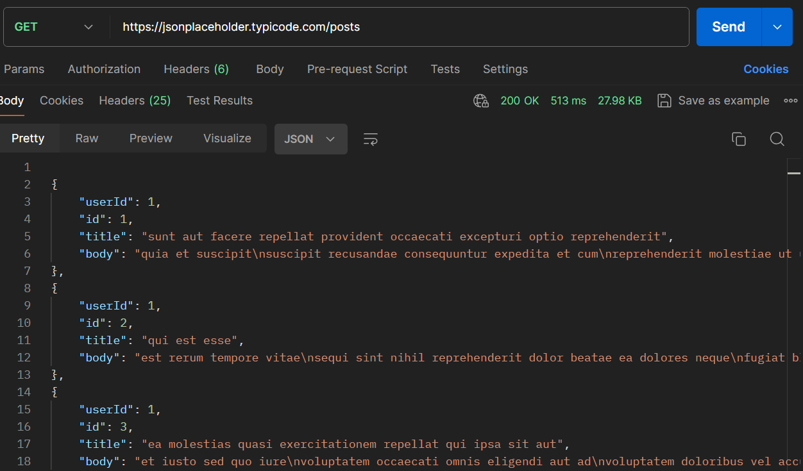
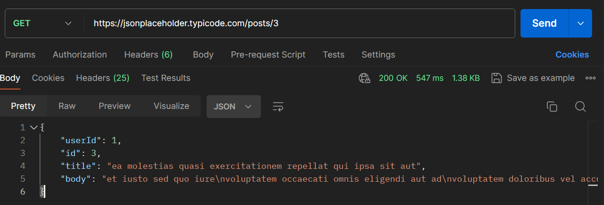
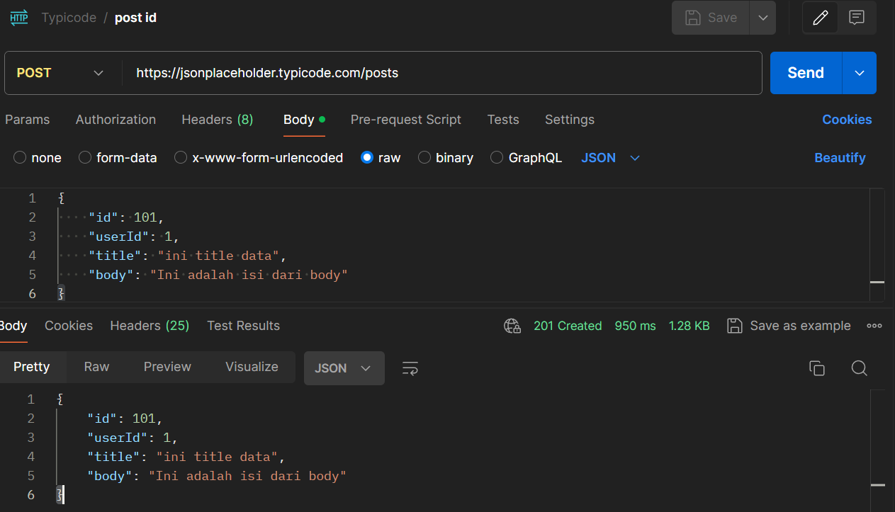
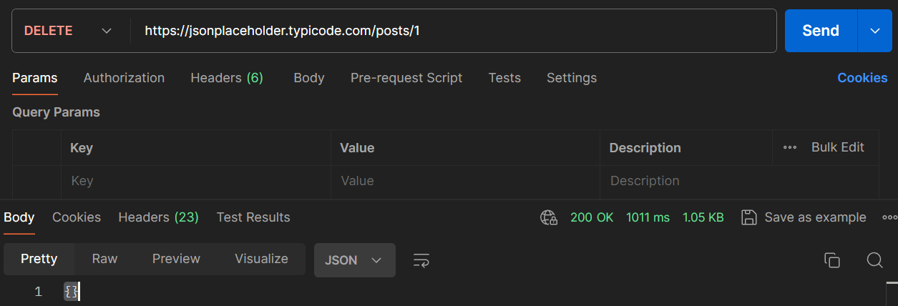

# Soal Prioritas 1

## GET Request

1. Lakukan GET request ke https://jsonplaceholder.typicode.com/posts dan tampilkan seluruh data yang diperoleh.

2. Lakukan GET request ke https://jsonplaceholder.typicode.com/posts/3 dan tampilkan data dengan id 3.
   POST Request:

## POST Request
1. Buat POST request ke https://jsonplaceholder.typicode.com/posts untuk menyimpan data postingan baru. Gunakan data dummy untuk body request.

## DELETE Request
1. Buat DELETE request ke https://jsonplaceholder.typicode.com/posts/1 untuk menghapus data postingan dengan id 1.
