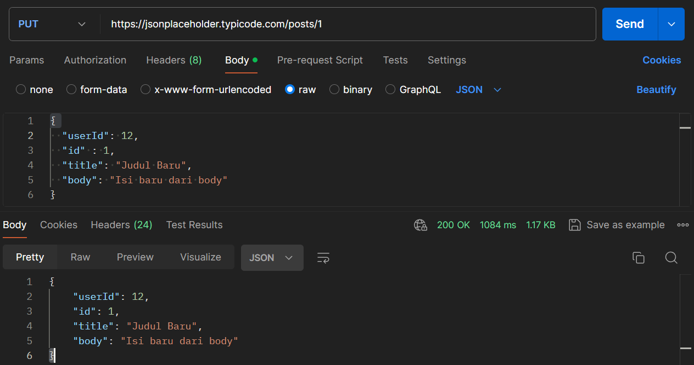
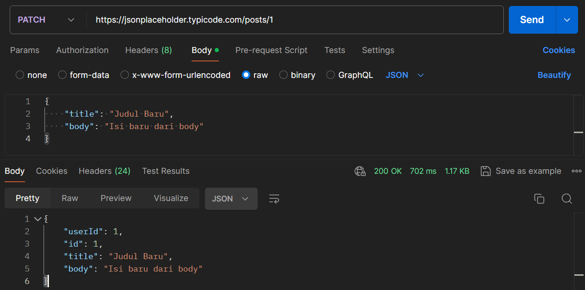

# Soal Prioritas 2

## PUT Request
1. Buat PUT request ke https://jsonplaceholder.typicode.com/posts/1 untuk mengupdate data postingan dengan id 1. Gunakan data dummy untuk body request.

## PATCH Request
1. Buat PATCH request ke https://jsonplaceholder.typicode.com/posts/1 untuk memodifikasi sebagian data postingan dengan id 1. Gunakan data dummy untuk body request.

