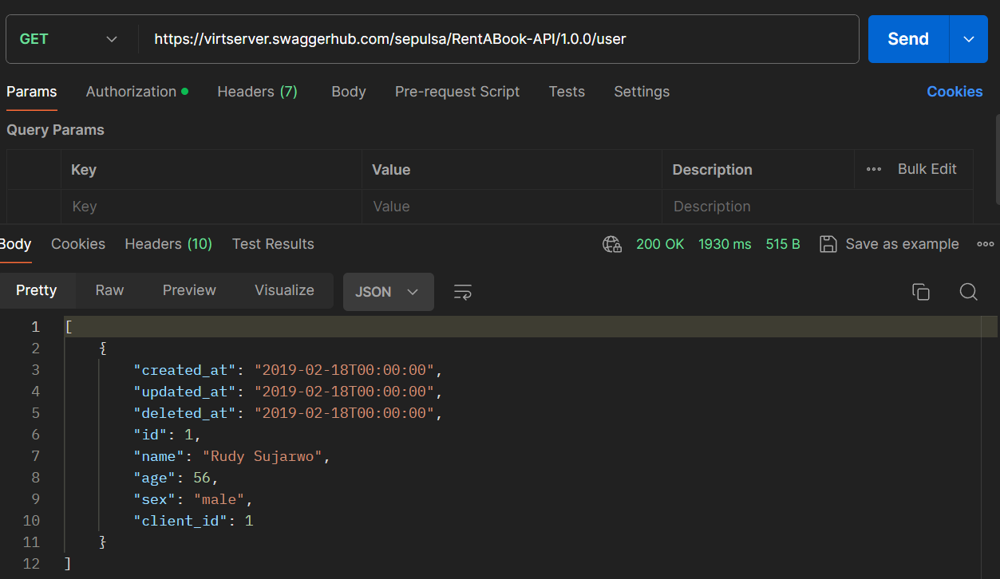
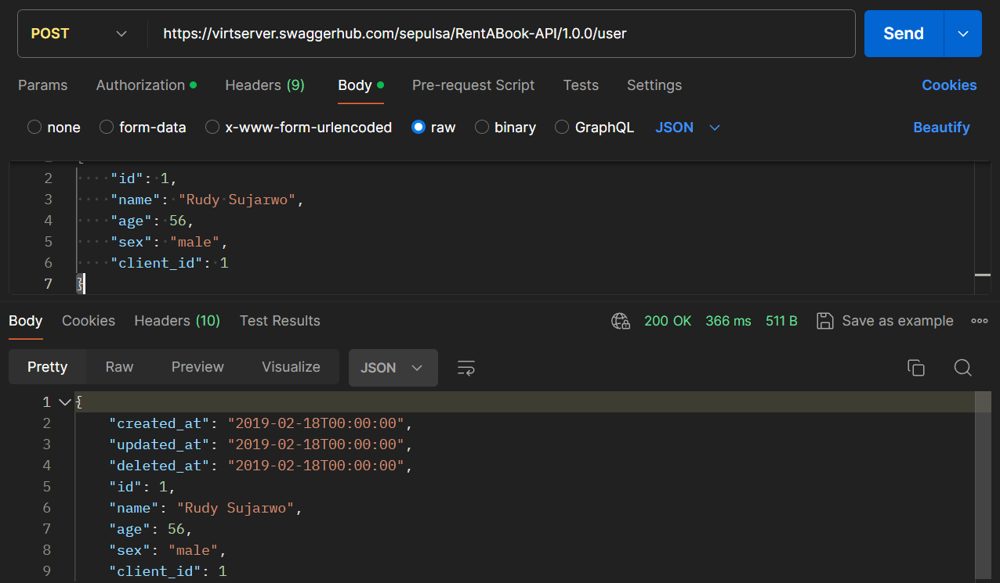
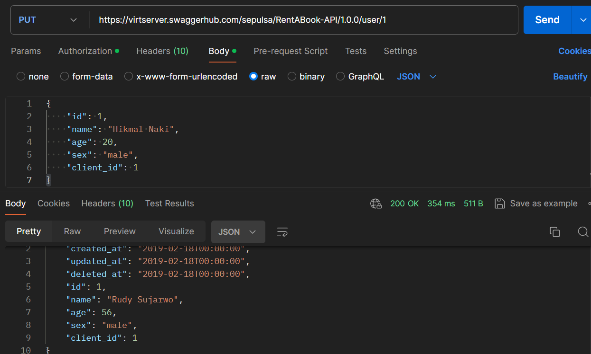
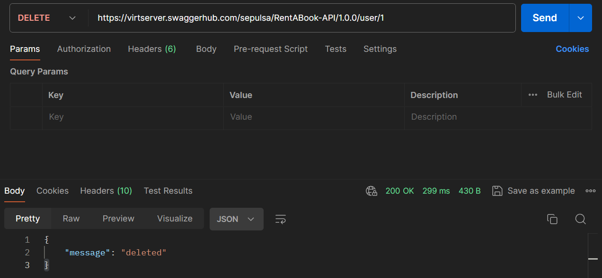

# Soal Eksplorasi

## Eksplorasi API RentABook

Endpoint pada RentABook API memiliki fungsi sebagai berikut:

Authentication: Meminta token akses untuk otentikasi.
Client: Melakukan operasi CRUD (Create, Read, Update, Delete) terhadap data klien.
User: Melakukan operasi CRUD terhadap data pengguna.
Book: Melakukan operasi CRUD terhadap data buku.
Rent: Melakukan operasi untuk mengelola transaksi peminjaman buku.

### 1. Authentication
- `GET /token` : Request access token

### 2. Client
- `GET /client/{id}` : Get client by id
- `PUT /client/{id}` : Update client
- `DELETE /client/{id}` : Delete client
- `GET /client` : Get all client
- `POST /client` : Add new client

### 3. User

- `GET /user/{id}` : Get user by id
- `PUT /user/{id}` : Update user
- `DELETE /user/{id}` : Delete user
- `GET /user` : Get all user
- `POST /user/` : Add new user

### 4. Book
- `GET /book/{id}` : Get book by id
- `PUT /book/{id}` : Update book
- `DELETE /book/{id}` : Delete book
- `GET /book` : Get all book
- `POST /book/` : Add new book

### 5. Rent
- `GET /rent/{id}` : Get book-rent transaction
- `GET /rent` : Get all rent transaction
- `POST /rent/` : Rent a book

## Implementasi HTTP Method

### GET Request

### POST Request

### PUT Request

### DELETE Request

