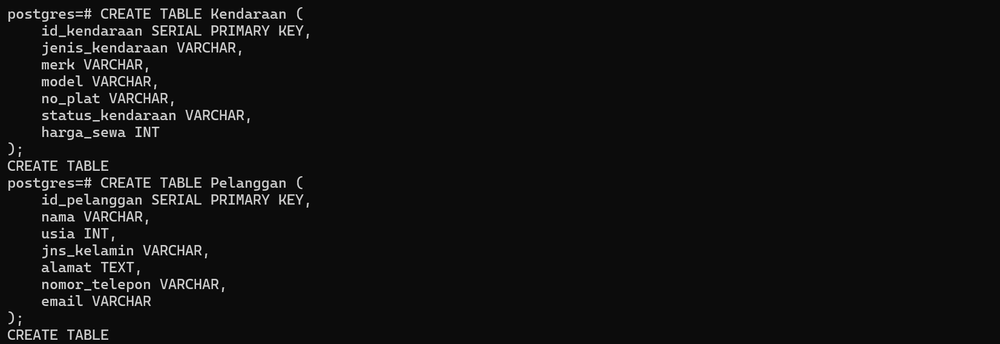
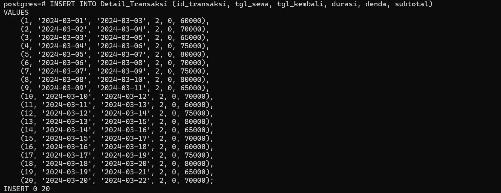
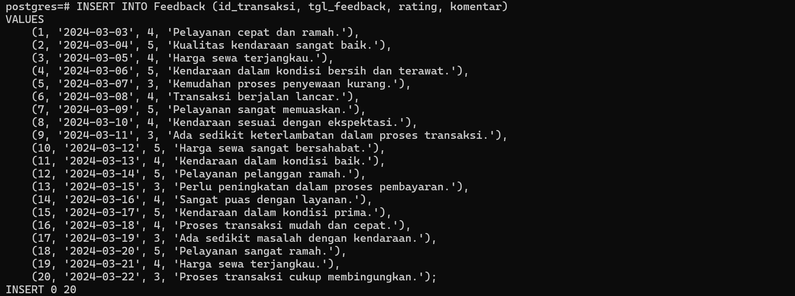
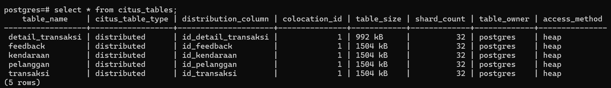
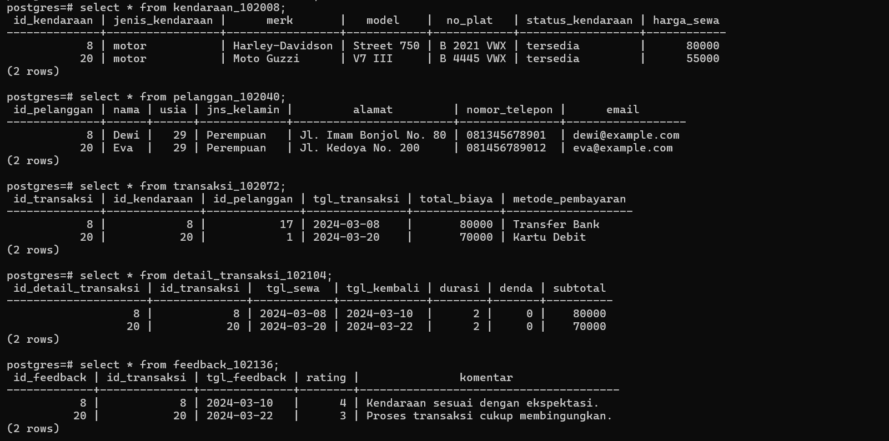

# Soal Prioritas 2

## 1. Membuat Diagram ERD Perusahaan Jasa Penyewaan

## 2. Membuat Tabel Terdistribusi Menggunakan Citus

### Menambahkan Node Worker

### Membuat Tabel Baru

### Menampilkan List Tabel

### Memasukkan Data Ke Dalam Tabel

### Menerapkan Replication dan Sharding

### Menampilkan List Tabel Terdistribusi 

### Menampilkan Data Tabel Berdasarkan Shard Name Tertentu

