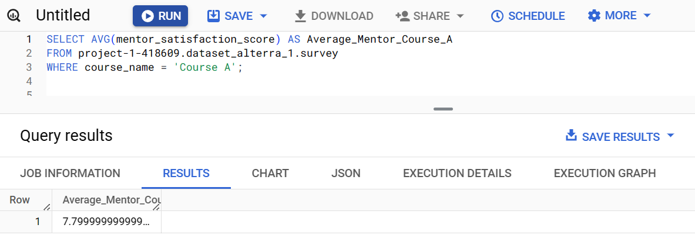

# Soal Eksplorasi

### Tampilkan rata-rata dari kepuasan mentor (mentor_satisfaction_score) secara keseluruhan.

### Tampilkan rata-rata dari kepuasan CS (cs_satisfaction_score) secara keseluruhan.

### Tampilkan rata-rata dari kepuasan mentor untuk “Course A”.

### Tampilkan nilai terendah dari kepuasan belajar (learning_satisfaction_score) untuk “Course C”.

### Tampilkan nilai tertinggi dari kepuasan CS (cs_satisfaction_score) untuk “Course B”.

### Tampilkan nama course dengan rata-rata kepuasan mentor tertinggi.

### Tampilkan nama course dengan rata-rata kepuasan belajar tertinggi.
