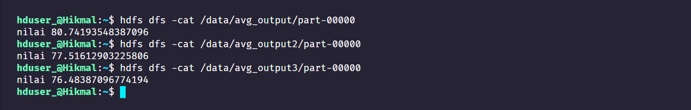

# Hadoop-avg-calculator

## Contoh output rata-rata dari masing-masing score.txt


## How to use
1. Copy the sample data. Make sure to replace `/home/hduser_` with the actual location in your local machine. `hdfs dfs -copyFromLocal <Path_Local> <Path_hdfs>`

```sh
hdfs dfs -mkdir /data
hdfs dfs -copyFromLocal /home/hduser_/score /data/score
```

2. Run this command to run Hadoop MapReduce.

```sh
hadoop jar $HADOOP_HOME/lib/hadoop-*streaming*.jar \
-file /home/hduser_/mapper.py -mapper /home/hduser_/mapper.py \
-file /home/hduser_/reducer.py -reducer /home/hduser_/reducer.py \
-input /data/score/score_1.txt -output /data/avg_output
```

3. Check the result.

```sh
hdfs dfs -cat /data/avg_output/part-00000
```